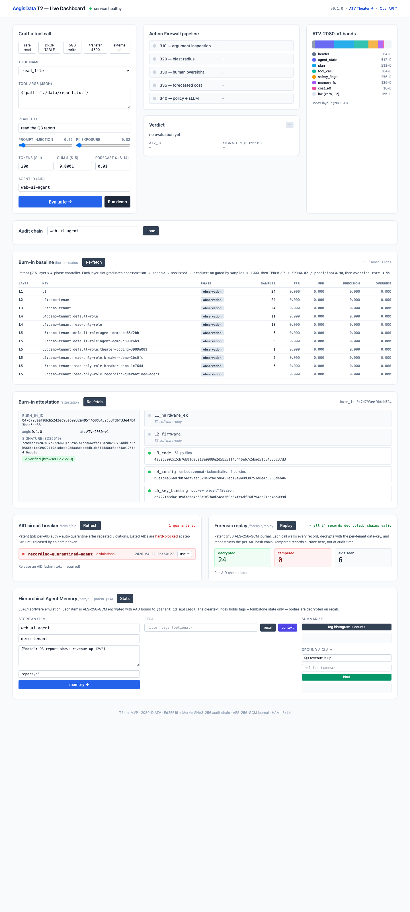

# I built an action firewall for AI agents — every tool call gets a 2,080-D vector, an Ed25519 signature, and a Merkle-chained audit record


> **TL;DR** — AegisData T2 is a Python sidecar that wraps every tool
> call your AI agent makes in a 2,080-dimensional Agent Trace Vector,
> runs it through a 7-stage Action Firewall, signs the verdict with
> Ed25519, chains it into a tamper-evident audit log, encrypts it into
> an AES-256-GCM forensic journal, and exposes a Hierarchical Agent
> Memory store — all in one container, with 326 passing tests and
> mypy-strict over 61 source files. Implements the T2 software tier of
> a 40-claim provisional patent. Code: `<repo URL>`. 60-second install:
> `docs/QUICKSTART.md`.

---

## The problem

If you've ever had Claude Code, Cursor, or a homegrown LangChain agent
running unattended, you've already had this thought: **what's actually
preventing this thing from doing something stupid?**

The answer in most setups today is "nothing." The model decides what
tool to call, the tool runs, and you find out it dropped a production
table when the on-call alert fires forty minutes later. The "guard
rails" are usually:

* A regex denylist in the system prompt that the model itself
  enforces. (The model.)
* `ALLOWED_TOOLS = [...]` in code, with no telemetry on what got
  rejected and why.
* A sticker on the laptop that says "review every `rm` before running."

What's missing is a **pre-commit firewall** — something the agent
posts every tool call to, that returns
`ALLOW / BLOCK / REQUIRE_APPROVAL` with a signed reason, and that
keeps a tamper-evident record so you can answer "what did the agent
actually try?" three months from now.

So I built one.

---

## What it does, in one screenshot



Top-down, that's:

1. **The form** for crafting a tool call by hand (preset buttons:
   "safe read", "DROP TABLE", "5GB write", "$500 transfer", "external
   API"). Every preset hits a different verdict.
2. **The pipeline** showing the call moving through 7 firewall stages
   in real time. Each stage's trace string is what you'd see in your
   logs.
3. **The ATV-2080-v1 band strip** — a color-coded visualization of
   the 2,080-D vector, broken into the 30 named subfields the patent
   defines (header, agent state, plan, tool call, safety flags,
   memory fingerprint, cost efficiency, hardware band).
4. **The audit chain** — every record signed with Ed25519, linked
   `prev_hash → this_hash` via SHA3-256. The dashboard verifies the
   chain client-side using WebCrypto.
5. **5-layer Burn-in baseline** — per-tenant / per-role / per-agent
   statistical maturity. Each layer slot graduates
   `observation → shadow → assisted → production` once it has 1000+
   labelled samples and passes TPR ≥ 0.95 / FPR ≤ 0.02 /
   precision ≥ 0.90 gates.
6. **Burn-in attestation** — an Ed25519-signed measurement of the
   running code (L3), config (L4), and signing key (L5). The
   dashboard re-verifies the signature in your browser, so a
   compromised server can't lie about what code it's running.
7. **AID circuit breaker** — per-AID (agent identifier) violation
   counter. Three unauthorized tool attempts and the agent gets
   auto-quarantined; future calls are hard-blocked at step 315
   until an admin token releases it.
8. **Forensic replay** — every audit record is also written to an
   AES-256-GCM journal with the cleartext header (tenant_id, aid,
   timestamp, ATV commitment) used as additional-authenticated-data.
   `GET /forensic/replay` decrypts the whole thing and rebuilds the
   per-AID hash chain. Tampered records surface here, not at
   audit-display time.
9. **Hierarchical Agent Memory** — the patent's 4-level memory
   hierarchy, T2-emulated as L3+L4 with an encrypted SQLite store
   plus an in-process LRU. Six operations:
   `memory / recall / context / forget / summarize / ground`. Every
   stored body is AES-256-GCM with AAD bound to the
   `(tenant_id, aid, seq)` identity tuple — tamper any of those and
   decryption fails.

That single page touches every endpoint the service exposes.

---

## What's in the box (the architecture)

```
host (your agent runtime)
  │  POST /evaluate { ATV-2080-v1 input }
  ▼
┌─────────────────────────────────────────────────────────────────────┐
│  Action Firewall                                                    │
│    step 310 — argument inspection (regex denylist + injection)      │
│    step 315 — AID-region authorization (M14 circuit breaker)        │
│    step 320 — blast radius lookup                                   │
│    step 330 — high-blast → REQUIRE_APPROVAL                         │
│    step 335 — forecasted cost gating (16-slot CostEfficiencyMetrics)│
│    step 340 — policy match + sLLM judge fallback                    │
│    step 350 — approval dispatch (M9)                                │
│    step 360 — Ed25519 sign + Merkle chain + AES-GCM journal (M9+M15)│
│    step 370 — exec recommendation: PROCEED / SUPPRESS / DEFER (M9)  │
└─────────────────────────────────────────────────────────────────────┘
  │
  ├─→ ATMU intent log: tentative → prepared → committed/aborted (M10)
  ├─→ Cost Attestation Ledger (separate Ed25519 key per Claim 34, M12)
  ├─→ Burn-in observer (5-layer × 4-phase, M11)
  └─→ Verdict { decision, reason, atv_id, signature, step_traces }

Out-of-band:
  GET  /forensic/replay      decrypt + rebuild per-AID chains (M15)
  GET  /admin/aid            list quarantined AIDs (M14)
  POST /admin/aid/release    admin token → release (M14)
  POST /ham/{memory,recall,context,forget,summarize,ground}  (M16)
```

Each "M" is a milestone — there are 16 of them, each tied to a
specific patent claim or paragraph. The full mapping is in
[`PLAN_v2.md`](PLAN_v2.md) §7.

The single most important design decision is that **every signed
record is independently verifiable**. The chain head, the Ed25519
public key, and the canonical-JSON record are all surfaced via the
API. You don't have to trust the server — you can re-verify in any
language with an Ed25519 library.

---

## What surprised me building it

### 1. The 2,080-D vector is the whole game

Most AI safety frameworks I've seen treat the tool call as opaque
text. The patent's insight is to lift it into a **fixed-shape vector**
where every position has a known semantic role. Once you do that:

* The sLLM judge can return per-subfield attribution scores ("I
  blocked this 60% on `tool_call`, 30% on `safety_flags.prompt_injection`,
  10% on `cost_efficiency_metrics.forecasted_cost`"). You get
  **explanations as a first-class output**, not as a hopeful string
  in the model's response.
* The Burn-in controller can detect **distribution drift** at the
  subfield level — "agent X's `cost_efficiency_metrics.cumulative_dollars`
  has been 4× the role baseline for 200 calls; flag for review."
* Tampering becomes detectable because the vector is part of the
  signed payload — flip a bit and the Ed25519 verification fails.

The 30 subfields aren't arbitrary. They're allocated across header
(64-D), agent state (512-D), plan (512-D), tool call (384-D), safety
flags (256-D), memory fingerprint (136-D), cost (16-D), and a 200-D
hardware band that's zero-filled in T2 and reserved for hardware
attestation in T3. It's a real schema, not a vibe.

### 2. The patent is full of working software, not handwaving

I read the full patent (`AegisData_US_Provisional_Patent_ATV_v7_10.docx`)
and translated each claim into a milestone. Some claims are obvious
in retrospect — Claim 34 says the **cost-attestation signing key
must be distinct from the telemetry signing key**, because cost
records may be selectively disclosed to billing while telemetry
stays private. So the codebase has two separate `Ed25519` keys and
two separate ledgers. Try forging a cost record without the cost
key — you can't, and you can't forge a telemetry record with the
cost key either.

Some claims are subtle: Claim 27 says cost-divergence escalation
must run **independently of the sLLM verdict**. The naive
implementation has the sLLM say "cost looks fine" and exits. The
patent-correct implementation runs three divergence metrics
(token-to-FLOPs, memory-cost, dollar-cost) against a Shadow-phase
baseline and escalates if any is 3× over, *regardless of what the
sLLM said*. So the codebase has a separate `escalate_if_diverged()`
that fires before the verdict is returned.

### 3. The hardest bug was a re-entrant lock

The AID circuit breaker (M14) uses a `threading.Lock` to serialize
violation-counter updates. Three different methods (`get`,
`list_quarantined`, `release`) all need to take a snapshot of the
in-memory state and return it to the caller. Naive implementation:
each method acquires the lock and calls `get(aid)` to build the
snapshot. Result: deadlock the moment two calls race, because
`threading.Lock` is non-reentrant.

The fix is the **snapshot-under-lock** pattern: `_snapshot_locked()`
is a private helper that does the actual snapshot work assuming the
caller already holds the lock. Public methods acquire once and call
the helper. Tests under thread contention pass. This is exactly the
kind of subtlety that the patent's hardware version (a tag
comparator at the memory controller) doesn't have to deal with —
T2 software is harder than T3 hardware in some places.

### 4. AEAD is a beautiful primitive

The encrypted journal (M15) is AES-256-GCM with the record's
cleartext header used as additional-authenticated-data. The header
holds `schema_version`, `key_version`, `tenant_id`, `aid`,
`atv_commitment`, and `ts_ns`. So if anyone flips a bit in the
header *or* the ciphertext, the GCM auth tag check fails. You get
**tamper-evidence at decrypt time** — not at audit-display time when
the bad data has already been quoted in 50 dashboards.

The replay endpoint (`GET /forensic/replay`) walks the journal
sequentially, AEAD-decrypts each record, rebuilds the per-AID
prev-hash chain, and reports `tampered_count: N`. Run it on a cron;
alert on anything > 0.

---

## What it's not

* **Not a runtime sandbox.** The firewall returns a verdict; it
  doesn't sandbox the actual tool execution. Pair with seccomp,
  OPA, or the platform's existing sandbox.
* **Not a model.** The sLLM judge is a thin wrapper around Claude
  Haiku 4.5 today, with attribution. The patent's intended end
  state (Claim 11) is a 0.1–1B parameter pinned model on FPGA/AIE
  for deterministic, bit-exact verdicts. T2 keeps the hosted call;
  T3 substitutes the silicon.
* **Not hardware-attested.** The "Burn-in" measurement is a hash
  of the running source, policy files, and signing key — signed at
  startup. T3 will swap that for MRENCLAVE-style TEE attestation
  with a hardware EK. The schema and signature surface stay
  identical so the swap is mechanical.

The full T2 ↔ T3 substitution table is in
[`docs/ARCHITECTURE.md`](docs/ARCHITECTURE.md) §
"What stays software in T2 vs. moves to hardware in T3".

---

## Try it

```bash
git clone <repo>
cd MVP
docker compose up -d --build
until curl -sf localhost:8000/healthz; do sleep 1; done
open http://localhost:8000              # macOS
xdg-open http://localhost:8000           # Linux
```

Send your first tool call:

```bash
curl -s localhost:8000/evaluate -H 'content-type: application/json' -d '{
  "header": {"trace_id":"t-001","span_id":"s-001","tenant_id":"demo",
             "aid":"my-agent","ats":"ATV-2080-v1",
             "schema_version":"ATV-2080-v1","tier_profile":"T2",
             "cost_attestation_profile":"software",
             "timestamp_ns":1737172800000000000},
  "agent_state_text":"user asked to read the Q3 report",
  "plan_text":"read ./data/report.txt",
  "tool_name":"read_file",
  "tool_args_json":"{\"path\":\"./data/report.txt\"}",
  "safety_flags":{"prompt_injection":0.02},
  "cost_estimate":{"input_token_count":120,"cumulative_dollars":0.0001,
                   "forecasted_cost_to_completion":0.01}
}' | jq
```

Returns:

```json
{
  "decision": "ALLOW",
  "reason": "all firewall steps passed",
  "atv_id": "…",
  "signature": "…",
  "step_traces": {
    "step310_args": "ok (inj=0.02)",
    "step315_aid_auth": "ok (aid=demo:default-role)",
    "step320_blast": "blast=1 (tool=read_file)",
    "step330_human": "ok (blast=1)",
    "step335_cost": "ok (cum=0.0001, forecast=0.01, ceiling=1.0)",
    "step340_policy": "allow match safe-read",
    "step370_exec": "exec-recommendation=PROCEED",
    "atmu.intent_log": "intent_record_id=…",
    "burnin.composite_score": "composite=0.000"
  }
}
```

Inspect the audit chain:

```bash
curl -s localhost:8000/audit/my-agent | jq
```

Or run the full demo (5-call scenario + M14 quarantine + M16 HAM):

```bash
docker compose exec aegis uv run python -m demo.agent_demo
```

Or just install it as a Claude Code `PreToolUse` hook and let it
firewall every tool call your editor makes:

```bash
bash tools/setup_macmini.sh   # installs the hook into ~/.claude/settings.json
```

---

## Project facts

* **Stack**: Python 3.11+, FastAPI, SQLite WAL, Ed25519, SHA3-256
  Merkle, AES-256-GCM (cryptography library), Claude Haiku 4.5 (with
  dummy fallback), OpenAI embeddings (with dummy fallback), uv,
  pytest, ruff, mypy strict, Docker (verified on OrbStack).
* **Tests**: 326 passing across unit + integration + e2e. mypy strict
  over 61 source files. ruff clean.
* **Concurrency**: 100-record SQLite audit chains, 200-line JSONL
  appends, 100-intent ATMU WAL, and per-AID circuit-breaker counters
  all pass under thread contention.
* **No-network mode**: defaults to `dummy` providers for embeddings
  and judge so it boots offline. Set `OPENAI_API_KEY` and
  `ANTHROPIC_API_KEY` in `.env` to switch to real backends.
* **Code size**: ~6,500 lines of Python source, ~2,500 lines of tests,
  ~2,000 lines of docs (this post + 4 docs files + 2 plan files).
* **Patent coverage**: full T2 software tier — every claim that
  doesn't require hardware. T3 hardware claims (CSD, FPGA, TEE) have
  schema placeholders in place but stay zero-filled.

---

## Where to go next

* **60-second install**: [`docs/QUICKSTART.md`](docs/QUICKSTART.md)
* **Per-milestone surface tour**: [`docs/ARCHITECTURE.md`](docs/ARCHITECTURE.md)
* **Production runbook**: [`docs/OPERATIONS.md`](docs/OPERATIONS.md)
* **Recording playbook** (90s + 5min scripts): [`docs/DEMO.md`](docs/DEMO.md)
* **Pre-rendered media kit** (GIF + 9 screenshots): [`demo/recording/README.md`](demo/recording/README.md)
* **Patent-aligned re-plan** with claim coverage matrix: [`PLAN_v2.md`](PLAN_v2.md)

---

## Acknowledgments

Built solo over ~3 weeks of evenings + weekends, scaffolded with
Claude Code (the irony of using an AI agent to build a firewall for
AI agents is not lost on me — and yes, the agent's own tool calls
were running through the firewall by milestone M14). The patent
(`AegisData_US_Provisional_Patent_ATV_v7_10.docx`) is the
intellectual scaffolding; this repo is one possible reduction of it
to working software in the T2 tier.

Comments, criticisms, code review, and patent-prior-art pointers all
welcome. Open an issue or email me.
