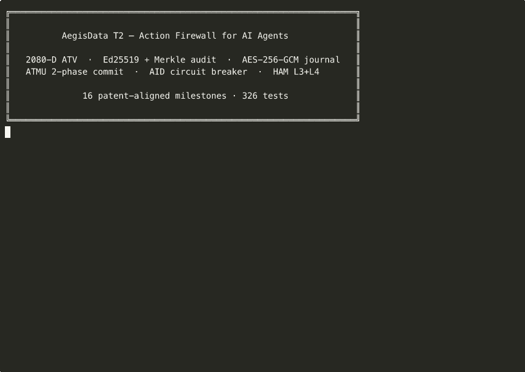

# AegisData T2 MVP

[](https://github.com/happyikas/Aegis-ATV/actions/workflows/ci.yml)



A Python sidecar that wraps every AI-agent tool call in a 2,080-dimensional
**Agent Trace Vector (ATV-2080-v1)**, runs it through a 7-stage Action
Firewall, brackets the call in an **Agent Telemetry Management Unit
(ATMU)** Write-Ahead Intent Log, asks an sLLM judge when needed,
**Ed25519-signs** every record, chains it into a **Merkle-linked
audit log**, encrypts it into an **AES-256-GCM forensic journal**,
maintains per-AID **circuit-breaker quarantines**, tracks per-tenant
**cost attestation** in a separately-keyed ledger, exposes a
**Hierarchical Agent Memory (HAM)** L3+L4 store, and feeds every
observation into a **5-layer Burn-in controller** that progresses
through Observation → Shadow → Assisted → Production.

Implements the **T2 (software-only) tier** of AegisData provisional
patent v7.10. The original 7-day MVP design is in [`PLAN.md`](PLAN.md);
the patent-aligned re-plan and per-milestone status is in
[`PLAN_v2.md`](PLAN_v2.md).

**Status (2026-04-28):** v3.0.0 — **ATV-native sLLM stack**. M1–M17 +
step311 donor rule pack + v2.1 Safe Auto-Run + v2.2 Poisoned
Instruction Detector + v2.3 HW emulation + v2.4 step337 HW anomaly
gate + **v3.0 attribution-head + local-Phi + hybrid judge**.
**905 tests pass**, ruff clean, mypy strict over 89 source files.

```bash
# v3.0: confidence-routing judge tower (M13 → Phi → Haiku → Dummy)
export AEGIS_JUDGE_PROVIDER=hybrid
AEGIS_EMBEDDING_PROVIDER=dummy AEGIS_JUDGE_PROVIDER=dummy \
  uv run python demo/judge_stack.py
# 5 / 5 scenarios decided at Tier 1 (M13) in <1ms aggregate

# v2.3+v2.4 HW/SW double-check live demo
AEGIS_EMBEDDING_PROVIDER=dummy AEGIS_JUDGE_PROVIDER=dummy \
  uv run python demo/hw_double_check.py
# honest agent ✓ + 6 attack modes ✗ all caught
#   3 by M12 escalation (Claim 27 cost axis)
#   3 by step337 (HW band IOMMU / hypervisor / network exfil)

# Sidecar mode: enable simulator + inject attack for demo
AEGIS_HW_PROVIDER=sim                              # T3 emulation on (HW band populated)
AEGIS_HW_INJECT_ATTACK=token_flops_mismatch        # demo: M12 escalation fires
```

```bash
uv run aegis install --mode sidecar    # multi-tenant FastAPI service
uv run aegis install --mode local      # Solo Free in-process hook (no service)
uv run aegis baseline init             # snapshot CLAUDE.md / AGENTS.md / .mcp.json
uv run aegis report                    # 5-line Agent Risk Report
```

* **Safe Auto-Run** — known-safe ops (Read/Grep/Glob, ls, pytest,
  ruff, git status) skip the sLLM judge — <5 ms median.
* **12 / 12 known incident classes** block + cloud destructive
  patterns (kubectl delete / terraform destroy / aws iam / unbounded
  DELETE) caught at step311.
* **Loop & Redundant Call Saver** — same call 3× → REQUIRE_APPROVAL;
  read-only repeats deduped and surfaced in `aegis report`.
* **Poisoned Instruction Detector** — CLAUDE.md / AGENTS.md /
  .mcp.json / plugin & skill manifest hashes baselined; any drift
  BLOCKs every subsequent PreToolUse until reviewed.
* **Local-mode signed audit chain** — SHA3-256 prev_hash / this_hash
  per line; `aegis verify-audit` catches mutations and re-orderings.

📖 **[v2.2 사용자 매뉴얼 (한국어)](docs/MANUAL_v2.2.md)** — 설치, CLI 레퍼런스, 시나리오, 트러블슈팅 14개 섹션.
🎯 10분 라이브 데모: [`docs/RUNBOOK.md`](docs/RUNBOOK.md).
📋 변경 내역: [`CHANGELOG.md`](CHANGELOG.md).

---

## What's in the box

| # | Milestone | Module | Patent |
|---|---|---|---|
| M1–M7 | Original MVP | `aegis.firewall.step{310,320,330,335,340}` · `aegis.judge.haiku` · `aegis.sign.ed25519` · `aegis.audit.{sqlite,jsonl}_store` · `aegis.attest.code_attestation` | Claims 1, 2 (partial), 17, 23 |
| M8 | ATV-2080-v1 30-subfield schema | `aegis.schema` (30 named slices, `CostEfficiencyMetrics` 16 slots) · `aegis.atv.builder` (19 SW encoders + HW band zero-fill) | Appendix A, Claims 6, 7, 9, 24 |
| M9 | Firewall split 350/360/370 | `aegis.firewall.step350_approval` · `step360_audit` · `step370_exec` | Claims 2, 16 |
| M10 | ATMU + Write-Ahead Intent Log + 2PC | `aegis.atmu.{state_machine, intent_log, checkpoint, compensating}` · `POST /tool-outcome` | Claims 2, 15 |
| M11 | 5-layer Burn-in × 4-phase graduation | `aegis.burnin.{phases, controller}` · `GET /burnin-status` | Claims 4, 13, 14, 19, 20 |
| M12 | Cost Attestation Ledger (separate key) + 3 divergence | `aegis.cost.{model_flops, divergence, escalation, ledger}` · `GET /cost-attestation/{aid}` | Claims 3, 26, 27, 30, 33, 34 |
| M13 | sLLM attribution head | `aegis.judge.haiku` (30-subfield contribution scores) · `step340` trace shows top-3 | Claims 8, 11 |
| M14 | AID auth + per-AID circuit breaker | `aegis.firewall.{step315_aid_auth, circuit_breaker}` · `policies/aid_region.json` · `aegis.api.admin_aid` | Claim 5B (¶[0063L]–[0063M]) |
| M15 | AES-256-GCM encrypted journal + forensic replay | `aegis.audit.{encrypted_journal, replay}` · `aegis.api.replay` (`GET /forensic/replay`) | §13B, ¶[0102G-1] |
| M16 | Hierarchical Agent Memory L3+L4 | `aegis.ham.store` · `aegis.api.ham` (7 endpoints) | §13A, ¶[0102C] |

The **hardware band (200-D, indices 1880..2079)** is intentionally
zero-filled in T2 per patent ¶[0042] — that's the T3 work.

### Endpoints

| Method | Path | Returns | Milestone |
|---|---|---|---|
| GET | `/healthz` | `{ok, version, burn_in_id}` | M1 |
| POST | `/evaluate` | `Verdict` (decision, reason, atv_id, signature, step_traces) | M1–M14 |
| POST | `/approve` | `{ok, atv_id, head}` | M1 |
| POST | `/tool-outcome` | `{ok, record_id, current_state, tool_outcome}` | M10 |
| GET | `/audit/{aid}` | `{aid, head, length, chain_valid, chain}` | M1 |
| GET | `/attestation` | code-attestation L3/L4/L5 + Ed25519 signature | M7 |
| GET | `/burnin-status` | per-layer phase + samples + TPR/FPR/precision | M11 |
| POST | `/burnin/graduate` | `{ok, layer_key, reason}` (409 if gates fail) | M11 |
| POST | `/burnin/label` | `{ok}` | M11 |
| GET | `/cost-attestation/{aid}` | per-AID Cost Attestation Records (separately signed) | M12 |
| GET | `/cost-attestation/by-tenant/{tenant_id}` | tenant-scoped ledger view | M12 |
| GET | `/admin/aid` | quarantined AIDs list | M14 |
| GET | `/admin/aid/{aid}` | full violation history for one AID | M14 |
| POST | `/admin/aid/release` | manual release (requires `X-Aegis-Admin-Token` header) | M14 |
| GET | `/forensic/replay` | walk encrypted journal, decrypt, per-AID chain validity | M15 |
| POST | `/ham/memory` | store an AID-bound encrypted item | M16 |
| POST | `/ham/recall` | retrieve by aid + tenant + tag filter | M16 |
| POST | `/ham/context` | assemble bundle of N most-recent items | M16 |
| POST | `/ham/forget` | tombstone an object (idempotent) | M16 |
| POST | `/ham/summarize` | counts + tag histogram | M16 |
| POST | `/ham/ground` | bind a claim to N memory references (returns SHA3 claim_hash) | M16 |
| GET | `/ham/stats` | total/live/tombstoned counts | M16 |
| GET | `/` | web dashboard (single-page) | — |
| GET | `/theater` | ATV Theater (band visualizer) | — |
| GET | `/source` | dashboard "Source-code paths" panel | — |

---

## Quick start

```bash
# 1. Install deps (downloads Python 3.11+ if missing)
uv sync

# 2. Run the test suite (326 tests)
uv run pytest -q

# 3. Lint + typecheck
uv run ruff check . && uv run mypy src

# 4. Boot the service
uv run uvicorn aegis.main:app --reload --port 8000

# 5. In a second shell — run the full demo
uv run python -m demo.agent_demo
```

The demo runs **the original 5-call scenario** (ALLOW/BLOCK/APPROVAL
mix) followed by **three extension scenarios** that exercise every M8–M16
endpoint:

```
=== M14: AID circuit breaker (aid=breaker-demo-…, role=read-only-role) ===
  violation 1/3 -> BLOCK: ... write_file; violations=1/3
  violation 2/3 -> BLOCK: ... write_file; violations=2/3
  violation 3/3 -> BLOCK: ... write_file; violations=3/3
  post-quarantine read_file -> BLOCK: AID … is quarantined — admin release required
  /admin/aid lists 1 quarantined AID(s).
  /admin/aid/release ok -> status=normal
  post-release read_file -> ALLOW: all firewall steps passed

=== M16: Hierarchical Agent Memory (aid=ham-demo-…) ===
  memory  -> object_id=…  seq=1
  memory  -> object_id=…  seq=2
  memory  -> object_id=…  seq=3
  recall(tags=['report']) -> 2 items
  context -> bundle of 3 items
  ground  -> bound=2 missing=1 claim_hash=630b056b3d6defc2…
  forget  -> ok=True
  summarize -> live=2 tag_hist={'calendar': 1, 'report': 1, 'customer': 1}

=== M15: Forensic replay (/forensic/replay) ===
  decrypted     = 10
  tampered      = 0
  aids touched  = 2
  chains valid  = 2/2
```

Set `AEGIS_DEMO_SKIP_EXTRAS=1` to run only the original 5-call scenario.

### One-shot helper

```bash
./demo/run_scenario.sh
```

Brings the service up via `docker compose` if available, otherwise via
`uv run uvicorn`, waits for `/healthz`, then runs the demo.

### Docker

```bash
docker compose up --build
```

The compose file provisions persistent volumes for the audit DB,
ATMU intent log, encrypted journal, HAM store, and signing keys
(distinct keys for telemetry vs. cost attestation per Claim 34).
Verified end-to-end with OrbStack on macOS.

### Use as a Claude Code firewall

`tools/aegis_hook.py` is a `PreToolUse` hook that fires before every
tool call inside Claude Code, asks the running Aegis service for a
verdict, and short-circuits the tool with stderr if blocked.
See [`tools/README.md`](tools/README.md) for install + tool mapping.

---

## Documentation

### Getting started

| Doc | What's in it |
|---|---|
| [`docs/QUICKSTART.md`](docs/QUICKSTART.md) | 60-second path: install → boot → first verdict → first chain |
| [`docs/ARCHITECTURE.md`](docs/ARCHITECTURE.md) | Per-milestone surface tour with file pointers, data flow diagrams, and patent-claim cross-references |
| [`docs/OPERATIONS.md`](docs/OPERATIONS.md) | Production runbook: env vars, key rotation, AID admin, journal forensics, backup/restore |
| [`docs/T3_BOUNDARY.md`](docs/T3_BOUNDARY.md) | T2 → T3 substitution boundary — exactly what changes (additive only) when implementing the hardware tier |
| [`docs/DOGFOOD.md`](docs/DOGFOOD.md) | Dogfood report Phase A — Aegis hook installed against an actual Claude Code session, 28 calls, 5 BLOCKs, 20 REQUIRE_APPROVALs, with TP/FP/FN taxonomy and 5 concrete code-change recommendations |
| [`docs/DOGFOOD_PHASE_B.md`](docs/DOGFOOD_PHASE_B.md) | Dogfood report Phase B — same 10-call battery rerun against the post-Recommendations firewall. 4 stricter, 1 softer, 0 regressions; 71% noise floor eliminated; all 3 false negatives closed |
| [`PLAN_v2.md`](PLAN_v2.md) | T2 patent-aligned re-plan (M8–M16) + claim coverage matrix |
| [`PLAN_v3.md`](PLAN_v3.md) | T3 hardware tier design (M17–M26) — TEE attestation, ML-DSA dual-sign, FPGA judge, CSD integration |
| [`SESSION_HANDOFF.md`](SESSION_HANDOFF.md) | **★ 새 챗 창 / 새 컨트리뷰터용 상태 스냅샷** — 한 파일에 마일스톤·디렉토리·명령어·트릭·옵션 모두. 새 세션 시작 시 이 파일 + CLAUDE.md + README 만 읽으면 충분. |
| [`WHITEPAPER.md`](WHITEPAPER.md) | **(한국어) 기술 백서 — 마크다운 소스** — 11 sections, ~1,300 lines (시장 / 사고 / 기술 / **사고 대응 7 시나리오** / MVP / POC / 데모 / 피치 / GTM / C-level) |
| [`docs/build/WHITEPAPER.pdf`](docs/build/WHITEPAPER.pdf) | **(한국어) 기술 백서 — PDF (49 pages, ~2.1 MB)** — A4 portrait, 디자인 커버 + 11 sections + 4 appendices (포함: **부록 D — 7 사고 시나리오 실제 실행 결과 9 pages**). `bash tools/whitepaper/build_pdf.sh` 로 재생성 |
| [`docs/build/PITCH_DECK.pdf`](docs/build/PITCH_DECK.pdf) | **(한국어) 투자자 피치 덱 — PDF (13 slides, A4 landscape, ~900 KB)** — Cover · Problem · Why now · 사고 사례 · Solution · 차별화 · Proof · Market · Business model · GTM · Roadmap · Team · Closing. `bash tools/deck/build_pdf.sh` 로 재생성 |
| [`demo/scenarios/`](demo/scenarios/) | **사고 대응 시나리오 7개 — 실행 가능 버전** — 백서 §5 의 시나리오 A–G를 PASS/FAIL 자동 검증 가능한 bash 스크립트로 재현. `bash demo/scenarios/run_all.sh` |
| [`SETUP_MACMINI.md`](SETUP_MACMINI.md) | Mac mini bootstrap for 24/7 Claude Code firewall use |
| [`tools/README.md`](tools/README.md) | Claude Code hook install + 10-case smoke test |

### Recording / launch kit

| Doc | What's in it |
|---|---|
| [`demo/recording/README.md`](demo/recording/README.md) | Pre-rendered media kit — GIF, asciinema cast, 9 dashboard screenshots, two TTS voiceover tracks |
| [`docs/DEMO.md`](docs/DEMO.md) | Click-by-click playbook — 90-second elevator + 5-minute deep-dive |
| [`docs/RECORDING_KIT.md`](docs/RECORDING_KIT.md) | Live-recording prep — three teleprompter scripts (60s / 90s / 5min), OBS scene setup, recording-day checklist, YouTube/Loom/LinkedIn metadata |
| [`LAUNCH.md`](LAUNCH.md) | Long-form launch blog post with embedded GIF |
| [`SHOW_HN.md`](SHOW_HN.md) | Hacker News submission copy + comment-thread playbook |
| [`TWITTER_THREAD.md`](TWITTER_THREAD.md) | Three X/Twitter thread variants with timing + hashtag guidance |

---

## Configuration

Copy `.env.example` to `.env` and fill in API keys when ready.

The defaults are deliberately offline-friendly:

| Setting | Default | Switch to real backend |
|---|---|---|
| `AEGIS_EMBEDDING_PROVIDER` | `dummy` | `openai` (needs `OPENAI_API_KEY`) |
| `AEGIS_JUDGE_PROVIDER` | `dummy` | `haiku` (needs `ANTHROPIC_API_KEY`) |
| `AEGIS_SAFETY_PROVIDER` | `dummy` | `openai` (Moderations) or `haiku` |
| `AEGIS_ADMIN_TOKEN` | `dev-admin-token` | any random string for production AID release |

Storage paths (auto-created on first run):

| Setting | Default |
|---|---|
| `AEGIS_AUDIT_DB` | `./data/audit.sqlite` |
| `AEGIS_AUDIT_JSONL` | `./data/audit.jsonl` |
| `AEGIS_INTENT_LOG_DB` | `./data/intent_log.sqlite` |
| `AEGIS_COST_LEDGER_DB` | `./data/cost_attestation.sqlite` |
| `AEGIS_COST_LEDGER_JSONL` | `./data/cost_attestation.jsonl` |
| `AEGIS_JOURNAL_PATH` | `./data/journal.bin` |
| `AEGIS_JOURNAL_DATA_KEY_PATH` | `./keys/journal_data.key` |
| `AEGIS_HAM_DB` | `./data/ham.sqlite` |
| `AEGIS_HAM_DATA_KEY_PATH` | `./keys/ham_data.key` |
| `AEGIS_SIGNING_KEY_PATH` / `_PUBLIC_KEY_PATH` | `./keys/ed25519.{pem,pub}` |
| `AEGIS_COST_SIGNING_KEY_PATH` / `_PUBLIC_KEY_PATH` | `./keys/ed25519_cost.{pem,pub}` (Claim 34: distinct from telemetry key) |
| `AEGIS_POLICY_DIR` | `./policies/` |

If you set the provider to `openai` / `haiku` but the corresponding key
is missing, the code automatically falls back to the dummy implementation
so nothing breaks.

---

## Web dashboard

Open [`http://localhost:8000`](http://localhost:8000) for the live
single-page dashboard. It surfaces every M8–M16 panel:

* **Craft a tool call** — preset buttons + sliders for `prompt_injection`,
  `pii_exposure`, the 16-slot cost metrics, and a free-form JSON args field
* **Action Firewall pipeline** — animated row-by-row trace through steps
  310 / 315 / 320 / 330 / 335 / 340 / 350 / 360 / 370
* **Verdict** — decision badge, reason, ATV id, Ed25519 signature
* **ATV-2080-v1 bands** — color-coded strip with deterministic intensity
  per band derived from `atv_id`
* **Audit chain** — per-AID Merkle chain with `prev_hash → this_hash`
  visualization and live `chain_valid` flag
* **Burn-in baseline** — per-layer phase + samples + TPR/FPR/precision
* **Burn-in attestation** — L1–L5 code/config/key hashes + browser-side
  Ed25519 signature verification
* **AID circuit breaker** (M14) — live quarantine list, admin release form
* **Forensic replay** (M15) — decrypted / tampered / aids-seen tiles +
  per-AID chain head listing
* **Hierarchical Agent Memory** (M16) — three-column store / recall /
  summarize+ground+forget interface; checkboxes auto-fill ground refs

`/theater` shows the ATV vector itself with a band-by-band breakdown.

---

## Tests

```bash
uv run pytest --cov=aegis
```

* **326 tests** across unit + integration + e2e
* **mypy --strict** over **61 source files**
* **ruff** clean
* **Concurrency**: 100-record SQLite audit chain, 200-line JSONL,
  100-intent ATMU WAL, and per-AID circuit-breaker counters all pass
  under thread contention
* **No network in tests**: respx mocks `api.anthropic.com`; OpenAI is
  unused under `dummy` provider

Per-milestone test files:

```
tests/unit/
├── test_step310_args.py … test_step370_exec.py        firewall
├── test_step315_aid_auth.py · test_circuit_breaker.py   M14
├── test_atmu_state_machine.py · test_intent_log.py     M10
├── test_burnin_*.py                                     M11
├── test_cost_*.py                                       M12
├── test_judge_haiku.py (attribution head)               M13
├── test_encrypted_journal.py · test_replay.py          M15
└── test_ham.py                                          M16

tests/integration/
├── test_evaluate_e2e.py · test_audit_chain_e2e.py      M1
├── test_tool_outcome_e2e.py                             M10
├── test_burnin_e2e.py                                   M11
├── test_cost_attestation_e2e.py                         M12
├── test_admin_aid_e2e.py                                M14
├── test_replay_e2e.py                                   M15
└── test_ham_e2e.py                                      M16
```

---

## Where to look

```
src/aegis/
├── schema.py                ATV slice constants + 30-subfield Pydantic models
├── config.py                pydantic-settings (.env loader)
├── main.py                  FastAPI factory + `app`
├── atv/
│   ├── embeddings.py        EmbeddingProvider abstraction
│   └── builder.py           build_atv() — 19 SW encoders + HW zero-fill
├── firewall/
│   ├── core.py              FirewallContext + run_firewall orchestrator
│   ├── circuit_breaker.py   M14 — per-AID violation counter + quarantine
│   ├── step310_args.py      pattern blocklist + injection threshold
│   ├── step315_aid_auth.py  M14 — AID-region authorization
│   ├── step320_blast.py     tool blast-radius lookup
│   ├── step330_human.py     high-blast → REQUIRE_APPROVAL
│   ├── step335_cost.py      M8 — forecast-gating with 16-slot metrics
│   ├── step340_policy.py    policy match + sLLM judge fallback
│   ├── step350_approval.py  M9 — approval dispatch (channels)
│   ├── step360_audit.py     M9 — sign + append + cost_attestation_hint
│   └── step370_exec.py      M9 — exec annotation (PROCEED/SUPPRESS/DEFER)
├── atmu/                    M10 — Agent Telemetry Management Unit
│   ├── state_machine.py     7-state machine + legal transitions
│   ├── intent_log.py        SQLite-backed Write-Ahead Intent Log
│   ├── checkpoint.py        blast≥7 checkpoint manifests
│   └── compensating.py      DEFAULT_COMPENSATION_STRATEGIES
├── burnin/                  M11 — 5-layer × 4-phase
│   ├── phases.py            Phase StrEnum + PhaseMetrics + can_graduate
│   └── controller.py        BurnInController (observe / record_label / try_graduate)
├── cost/                    M12 — Cost Attestation Ledger
│   ├── model_flops.py       FLOPS_PER_TOKEN per model
│   ├── divergence.py        token-to-FLOPs / memory-cost / dollar-cost metrics
│   ├── escalation.py        Claim 27 — independent of sLLM verdict
│   └── ledger.py            separate Ed25519 key + per-aid Merkle chain
├── judge/
│   ├── base.py              Judge ABC + JudgeVerdict (with `subfield_attribution`)
│   ├── haiku.py             M13 — Claude Haiku 4.5 + attribution head
│   └── dummy.py             offline stub
├── sign/
│   ├── ed25519.py           keypair management + sign/verify
│   └── merkle.py            chain hashing + verify_chain
├── audit/
│   ├── sqlite_store.py      indexed records + chain head (transactional)
│   ├── jsonl_store.py       append-only raw record dump
│   ├── encrypted_journal.py M15 — AES-256-GCM with AAD-bound header
│   └── replay.py            M15 — ReplayReport + per-AID chain rebuild
├── ham/                     M16 — Hierarchical Agent Memory L3+L4
│   └── store.py             encrypted SQLite + L1 OrderedDict cache
├── attest/
│   ├── code_attestation.py  L3/L4/L5 hashes signed at startup
│   └── burn_in.py           BurnInMeasurement assembly
└── api/
    ├── evaluate.py          POST /evaluate
    ├── approve.py           POST /approve
    ├── audit_query.py       GET  /audit/{aid}
    ├── attestation.py       GET  /attestation
    ├── tool_outcome.py      POST /tool-outcome (M10)
    ├── burnin_status.py     M11 endpoints
    ├── cost_attestation.py  M12 endpoints
    ├── admin_aid.py         M14 endpoints
    ├── replay.py            M15 endpoint
    ├── ham.py               M16 endpoints
    └── source.py            dashboard source-peek

policies/
├── default.json             deny + allow rules (PLAN 6.9)
└── aid_region.json          M14 — per-AID role policy

demo/
├── agent_demo.py            5-call scenario + M14/M15/M16 extensions
├── tools.py                 Anthropic tool catalog
└── run_scenario.sh          bring service up + run demo

tools/
├── aegis_hook.py            Claude Code PreToolUse hook
├── aegis_safety.py          PRE-LLM safety classifier (regex / OpenAI / Haiku)
└── test_hook.sh             10-case smoke test
```

---

## T3 — patent-future work

The T3 (hardware) tier is fully specified — see
[`PLAN_v3.md`](PLAN_v3.md) for the 10-milestone breakdown (M17–M26)
and [`docs/T3_BOUNDARY.md`](docs/T3_BOUNDARY.md) for the
T2 → T3 substitution boundary.

Quick summary of what T3 adds:

| Phase | Milestones | Adds |
|---|---|---|
| **A** TEE software path (cloud-available) | M17–M19 | Real Intel TDX / AMD SEV-SNP attestation · ML-DSA post-quantum dual-signing · HW perf-counter cost attestation |
| **B** In-storage / accelerator | M20–M22 | FPGA/AIE bit-exact deterministic sLLM judge · HW tag comparator at memory controller · NVMe-CSD integration with in-storage similarity |
| **C** Cross-cutting hardening | M23–M26 | Per-AID HW resource counters · TEE-sealed key storage · Linkage-consistency vector (SW↔HW drift detection) · ZK range proof for cost dimensions (stretch) |

**The external contract doesn't move.** T2 clients talk to T3 servers
without code changes — schema, endpoints, and JSON shapes stay
identical. The only visible difference is that some response fields
stop being zero.

T3 hardware claims (CSD, FPGA, TEE) have schema placeholders already
in place — `tier_profile`, `cost_attestation_profile`, the 200-D HW
band, the `hw_cost_attestation` subfield range 2044..2059, the
`linkage_consistency_features` 2060..2079. T3 fills these
placeholders without breaking the external contract.
